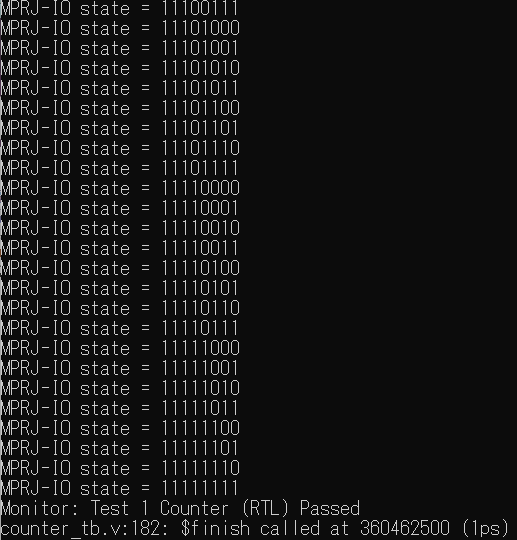

[](https://opensource.org/licenses/Apache-2.0) [](https://github.com/efabless/caravel_project_example/actions/workflows/user_project_ci.yml) [](https://github.com/efabless/caravel_project_example/actions/workflows/caravel_build.yml)

# Edge Circuit Designer

[AI Generated Design Contest 2](https://efabless.com/ai-generated-design-contest-2)

# Project Documentation
This project is an Edge AI execution environment for running Meta's [LLaMa2](https://ai.meta.com/llama/) and [Code LLaMa](https://codellama.dev/about) on a Raspberry Pi 4 with 64-bit OS to automatically generate verilog code.  
The setup procedure is described below.

## Setup Raspberry Pi 4 as Edge AI
### Hardware
#### Requirements of Raspberry Pi
- Hardware
	- Raspberry Pi 4 8GB
- OS
	- Raspberry Pi OS Lite 64bit
- SD Card
	- 128GB or more

#### Pre-setup Image
If you have trouble setting up your own system, you can use [this image](https://www.noritsuna.jp/download/RPi4_AIGDC2_Edge_Circuit_Designer.img.xz).

### Software
#### Setup LLaMa Engine
Download the latest version (version after 6/6/2023).  And Build it.
[https://github.com/ggerganov/llama.cpp](https://github.com/ggerganov/llama.cpp)

```
sudo apt install git build-essential
git clone https://github.com/ggerganov/llama.cpp
cd llama.cpp
make
```

#### Preparation of LLaMa2 data
Download [LLaMa2](https://ai.meta.com/llama/) data from Meta's website and convert it to GGML format using a converter that is built at the same time.
```
convert-llama2c-to-ggml
```

However, since a fairly powerful GPU, etc. is required, data converted to GGML is available and may be used here.
```
wget https://huggingface.co/TheBloke/Llama-2-7B-GGML/blob/main/llama-2-7b.ggmlv3.q4_K_M.bin
```

#### Preparation of Code LLaMa data
 [Code LLaMa](https://codellama.dev/about) , a fine-tuning of LLaMa2 in a programming language, will also be prepared.

However, since a fairly powerful GPU, etc. is required, data converted to GGML is available and may be used here.
```
wget https://huggingface.co/TheBloke/CodeLlama-7B-GGML/blob/main/codellama-7b.ggmlv3.Q4_K_M.bin
```


### Execution
The following command will prompt:  


#### LLaMa2(Q4)
```
./main -m ./models/7B/llama-2-7b.ggmlv3.q4_K_M.bin \
       --color \
       --ctx_size 2048 \
       -n -1 \
       -ins -b 256 \
       --top_k 10000 \
       --temp 0.2 \
       --repeat_penalty 1.1 \
       -t 8
```


#### Code LLaMa(Q4)
```
./main -m ./models/7B/codellama-7b.ggmlv3.Q4_K_M.bin \
       --color \
       --ctx_size 2048 \
       -n -1 \
       -ins -b 256 \
       --top_k 10000 \
       --temp 0.2 \
       --repeat_penalty 1.1 \
       -t 8
```


## Build code created by Edge AI
The Verilog code generated by the above Edge AI is built in an environment prepared on a PC.  


### Download Edge_Circuit_Designer Project
```
git clone https://github.com/noritsuna/Edge_Circuit_Designer.git
```


### Generation GDSII
```
export PDK=sky130A
make setup
make Edge_Circuit_Designer
make user_project_wrapper
```


### Running Pre-Checks for ChipIgnite
```
make precheck
make run-precheck
```


# Prompt Documentation
## Prompt
The prompts used in the Edge_Circuit_Designer Project are as follows:  
```
Please generate a 16 bits counter in verilog.
```

## Output by LLaMa2(Q4)
The following output is the result of the output by LLaMa2.    
Build fails because `reg [15:0] count;` does not match the grammar.

```
module counter(
        input clk,
        input reset,
        output [15:0] count);

        reg [15:0] count;

        always @ (posedge clk) begin
                if (!reset) begin
                        count <= 16'h0000;
                end else begin
                        count <= count + 1;
                end
        end

endmodule
```


## Output by Code LLaMa(Q4)
The following output by Code LLaMa, which is based on LLaMa2 and fine-tuned for programming languages.  
Unlike LLaMa2, the operable code is output. However, only about 1 in 10 times is output correctly.  
This time, the GDSII output is based on this.

```
module counter(clk,rst,q);
        input clk, rst;
        output [15:0] q;

        reg [15:0] q;

        always @ (posedge clk or posedge rst) begin

                if (rst == 1'b1) begin

                        q <= 16'h000;

                        end else begin


                                q <= q + 16'h0001;

                                end


                                end


                                endmodule
```


# Code
It is a very simple 16-bit counter.

```
module counter(clk,rst,q);
        input clk, rst;
        output [15:0] q;

        reg [15:0] q;

        always @ (posedge clk or posedge rst) begin

                if (rst == 1'b1) begin

                        q <= 16'h000;

                        end else begin


                                q <= q + 16'h0001;

                                end


                                end


                                endmodule
```


# Verification Coverage
A test bench is being created for the above Code (16-bit counter).  
More details can be found [here](verilog/dv/README.md).

## Execution Test Bench
The test bench is executed with the following commands.

```
make simen
make verify-counter-rtl
make verify-counter-gl
```


## Generation STA
Timing files are generated by the following commands.

```
make setup-timing-scripts
make install_mcw
make extract-parasitics
make create-spef-mapping
make caravel-sta
```


# Technical Merit
This is an edge computing system that does not have Merit in the AI generated results, but rather gains Merit by applying the AI generation system.  
We believe this will yield three Merits.

## 1st Merit
The fact that it works at the Raspberry Pi level means that it can be integrated into an embedded device (smartphone) level processing device. In other words, it could be incorporated into each semiconductor manufacturing device.  

Although we did not go as far as outputting a testbench this time, it is theoretically possible to generate the source code for a testbench with a generative AI.  
This can be applied to automatically generate test benches by semiconductor manufacturing equipment (manufacturing process).  

Since this is not expected in the current process, information about the fab and equipment is available to the public in order to have the necessary test benches written. However, it is believed that it also contains information that the company would not want to disclose outside the company.  

Therefore, by bringing in a testbench generated by AI, it may be possible to minimize the information to be disclosed by automatically generating a testbench in the process by having the designer (client) present the "testbench specifications".  

This is a Merit for both the fab operator and the designer who does not want to write test benches.


## 2nd Merit
You can do your own LLM data "Fine Tuning". By "Fine Tuning" your own source code or circuits, you can have the AI generate source code or circuits that copy your habits.  

This is a very important Merit.  

If an engineer were to have a generative AI automatically generate source code or circuits, he or she would not use the source code or circuits as they are, but rather modify them based on them. In that case, the engineer must read and understand that automatically generated source code and circuitry. And it is easier for engineers to understand source code and circuits they have written than to understand automatically generated (written by others) source code and circuits.  
For example, personal habits, such as the use or non-use of ternary operators, can appear in source code and circuits. Generative AI generates source code and circuits that incorporate these individual quirks.  

This is a Merit to all engineers.


## 3rd Merit
Multiple Raspberry Pi, which are very inexpensive devices, can be clustered together and used in the same way as a PC with a powerful GPU costing $100,000 to $1 million.  
This means that researchers and engineers, who until now have only been able to use generative AI provided by others, can now participate in the research and development of generative AI. This will allow many researchers and engineers to conduct a variety of research and development, which can be expected to produce more results.  

This is a Merit to all mankind.


## Conclusion
As described above, a new world could be opened up by running your own customized LLM on a small & inexpensive device such as the Raspberry Pi or on your personal PC.


# Project Description and Community Interest Poll
## Project Description
This project is an Edge AI execution environment for running Meta's [LLaMa2](https://ai.meta.com/llama/) and [Code LLaMa](https://codellama.dev/about) on a Raspberry Pi 4 with 64-bit OS to automatically generate verilog code.  
In this case, a simple 16-bit counter was generated. However, as noted in #Technical Merit, this is a system that shows promise.  
And We call this system "Edge Circuit Designer".  


## Community Interest Poll
The results of this study showed that Code LLaMa LLM data fine-tuned to the programming language was better than the generic LLaMa2 LLM data.  
In other words, LLM data (such as LLaMa2) tuning using Verilog-specific training models or training data using your own source code could potentially support a variety of models.   

If you want to create a Verilog-specific training model, you can simply scrape the Verilog files on github.However, it is difficult to use the files as public data because they may not have permission to be used as training data.  

Therefore, The more Verilog files made available by the community, the more valuable this system will be. We are convinced that this will be of great help to those who use this system.

### How to Fine Tuning
- Software for Fine Tuning LLM data (LLaMa2)
	- `finetune.py` from [Alpaca-lora](https://github.com/tloen/alpaca-lora)
		- Rewrite two parameters in `finetune.py`
>    base_model: str = "", ;The LLM data path  
>    data_path: str = "",  ;The Training data path


# Forked from the Caravel User Project

| :exclamation: Important Note            |
|-----------------------------------------|

## Caravel information follows

Refer to [README](docs/source/index.rst#section-quickstart) for a quickstart of how to use caravel_user_project

Refer to [README](docs/source/index.rst) for this sample project documentation. 
