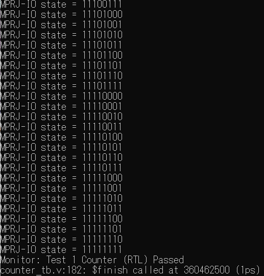

<!---
# SPDX-FileCopyrightText: 2020 Efabless Corporation
#
# Licensed under the Apache License, Version 2.0 (the "License");
# you may not use this file except in compliance with the License.
# You may obtain a copy of the License at
#
#      http://www.apache.org/licenses/LICENSE-2.0
#
# Unless required by applicable law or agreed to in writing, software
# distributed under the License is distributed on an "AS IS" BASIS,
# WITHOUT WARRANTIES OR CONDITIONS OF ANY KIND, either express or implied.
# See the License for the specific language governing permissions and
# limitations under the License.
#
# SPDX-License-Identifier: Apache-2.0
-->

# Table of Contents
* [Quick Start](./README.md#quick-start)
* [For advanced users](./README.md#for-advanced-users)
	* [Simulation Environment Setup](./README.md#simulation-environment-setup)
		* [Docker](./README.md#1-docker)
	* [Running Simulation](./README.md#running-simulation)
	*  [User Project Example DV](./README.md#user-project-example-dv)
		*  [counter Test](./README.md#counter-test)

# Quick Launch for Designers

## Dependencies

- Docker: [Linux](https://hub.docker.com/search?q=&type=edition&offering=community&operating_system=linux&utm_source=docker&utm_medium=webreferral&utm_campaign=dd-smartbutton&utm_location=header) ||  [Windows](https://desktop.docker.com/win/main/amd64/Docker%20Desktop%20Installer.exe?utm_source=docker&utm_medium=webreferral&utm_campaign=dd-smartbutton&utm_location=header) || [Mac with Intel Chip](https://desktop.docker.com/mac/main/amd64/Docker.dmg?utm_source=docker&utm_medium=webreferral&utm_campaign=dd-smartbutton&utm_location=header) || [Mac with Apple Chip](https://desktop.docker.com/mac/main/arm64/Docker.dmg?utm_source=docker&utm_medium=webreferral&utm_campaign=dd-smartbutton&utm_location=header)

## Running the simulation

Assuming you already:
- went throught the [quick start](https://github.com/efabless/caravel_user_project/blob/main/docs/source/quickstart.rst) for setting up your environemnt,
- integrated your design into the user's wrapper and
- hardenned your design as well as the user's wrapper (for GL simulation)

````
make simenv
SIM=RTL make verify-<dv-test>
# OR
SIM=GL make verify-<dv-test>
````
``<dv-test>``: io_ports, mprj_stimulus, la_test1, la_test2 or wb_port.  

# For advanced users

## Simulation Environment Setup

There are two options for setting up the simulation environment: 

* Pulling a pre-built docker image 
* Installing the dependecies locally. Instructions to setting up the environment locally can be found [here](https://github.com/efabless/caravel_user_project/verilog/dv/local-install.md)

### Docker

There is an available docker setup with the needed tools at [efabless/dockerized-verification-setup](https://github.com/efabless/dockerized-verification-setup) 

Run the following to pull the image: 

```
docker pull efabless/dv_setup:latest
```

## Running Simulation

First, you will need to export a number of environment variables: 

```bash
export PDK_PATH=<pdk-location/sky130A>
export CARAVEL_ROOT=<caravel_root>
export TARGET_PATH=<caravel_user_project>
```

Then, run the following command to start the docker container :

```
docker run -it -v ${TARGET_PATH}:${TARGET_PATH} -v ${PDK_ROOT}:${PDK_ROOT} \
		-v ${CARAVEL_ROOT}:${CARAVEL_ROOT} \
		-e TARGET_PATH=${TARGET_PATH} -e PDK_ROOT=${PDK_ROOT} \
		-e CARAVEL_ROOT=${CARAVEL_ROOT} \
		-e TOOLS=/foss/tools/riscv-gnu-toolchain-rv32i/411d134 \
		-e DESIGNS=$(TARGET_PATH) \
		-e CORE_VERILOG_PATH=$(TARGET_PATH)/mgmt_core_wrapper/verilog \
		-e MCW_ROOT=$(MCW_ROOT) \
		efabless/dv_setup:latest
```

Then, navigate to the directory where the DV tests reside : 

```bash
cd $TARGET_PATH/verilog/dv/
```

To run any simulation, you need to be on the top level or caravel_user_project.

To run RTL simulation for one of the DV tests, 

```bash
SIM=RTL make verify-<dv-test>
```

To run gate level simulation for one of the DV tests, 

```bash
SIM=GL make verify-<dv-test>
```

# Project DV

A discription of the testbenche

The directory includes one test for the counter user-project: 

### counter Test 

* This test is meant to verify that we can configure the pads for the user project area. The firmware configures the lower 8 IO pads in the user space as outputs:

	```c
	reg_mprj_io_0 =  GPIO_MODE_USER_STD_OUTPUT;
	reg_mprj_io_1 =  GPIO_MODE_USER_STD_OUTPUT;
	.....
	reg_mprj_io_7 =  GPIO_MODE_USER_STD_OUTPUT;
	```

* Then, the firmware applies the pad configuration by enabling the serial transfer on the shift register responsible for configuring the pads and waits until the transfer is done. 
	```c
	reg_mprj_xfer = 1;
	while (reg_mprj_xfer == 1);
	```

* The testbench success criteria is that we can observe the counter value on the lower 8 I/O pads. This criteria is checked by the testbench through observing the values on the I/O pads as follows: 

	```verilog
	wait(mprj_io_0 == 8'h01);
	wait(mprj_io_0 == 8'h02);
	wait(mprj_io_0 == 8'h03);
	....
	wait(mprj_io_0 == 8'hFF);
	```

* If the testbench fails, it will print a timeout message to the terminal. 


